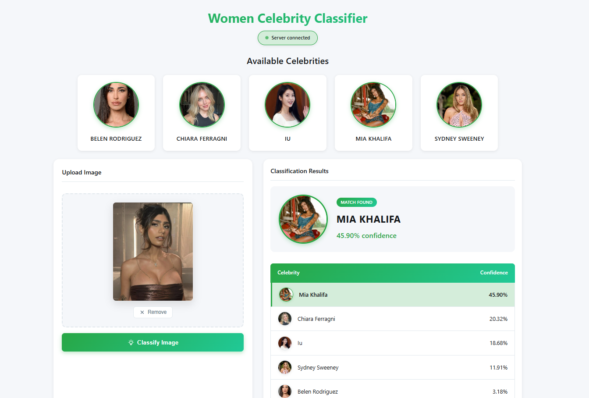

# Women Celebrities Image Classification

End-to-end face detection, feature extraction, and celebrity classification with a Flask API and a single‑page web UI.

## UI Preview


## Features
- Face/eye detection with Haar cascades (OpenCV)
- Automated face cropping into `model/dataset/cropped/`
- Feature engineering with wavelet transforms (PyWavelets)
- Model comparison (SVM, Random Forest, Logistic Regression)
- Exported model + class mapping for inference
- Flask API for classification
- Single‑page UI with upload, preview, and probability table

## Classes in the dataset
`belen_rodriguez`, `chiara_ferragni`, `iu`, `mia_khalifa`, `sydney_sweeney`.

## Project structure
- `model/sport_person_classifier_model.ipynb` training + evaluation notebook
- `model/dataset/` dataset organized by class
- `model/test_images/` test images used by the notebook
- `model/opencv/haarcascades/` Haar cascade XML files
- `model/requirement.txt` Python dependencies
- `model/saved_model.pkl` exported trained model (joblib)
- `model/class_dictionary.json` class name → numeric id mapping
- `server/` Flask API and inference utilities
- `server/artifacts/` runtime model + class mapping used by the API
- `UI/` single‑page web app
- `UI/images/` celebrity images used in the UI (filenames match class names)

## Quick setup
1. Create the virtual env:
```bash
python3 -m venv .venv
```
2. Activate it:
```bash
source .venv/bin/activate
```
3. Install dependencies:
```bash
pip install -r model/requirement.txt
```

## Run the API
The API loads artifacts from `server/artifacts/`, so run it from the `server/` folder.

```bash
cd server
python3 server.py
```

Endpoints:
- `GET /class_dictionary`
- `POST /classify_image` (form field: `image_data` base64 data URL)

## Run the UI
Serve the UI with a local web server (avoid `file://`, which blocks `fetch`).

```bash
cd UI
python3 -m http.server 8000
```

Open in the browser:
```
http://localhost:8000/app.html
```

## Training pipeline (high level)
1. Detect faces and require at least two eyes.
2. Crop faces and save them under `model/dataset/cropped/`.
3. Build features by stacking the raw 32×32 RGB image and its wavelet transform.
4. Train and compare multiple classifiers.
5. Export the best model and class mapping.

## Updating runtime artifacts
If you retrain the model, copy the new artifacts into the API folder:
- `model/saved_model.pkl` → `server/artifacts/saved_model.pkl`
- `model/class_dictionary.json` → `server/artifacts/class_dictionary.json`

## Notes
This project was a funny experiment/play around inspired by some Youtube tutorial
